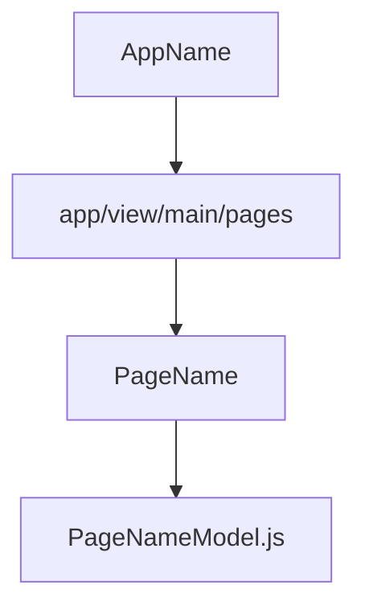
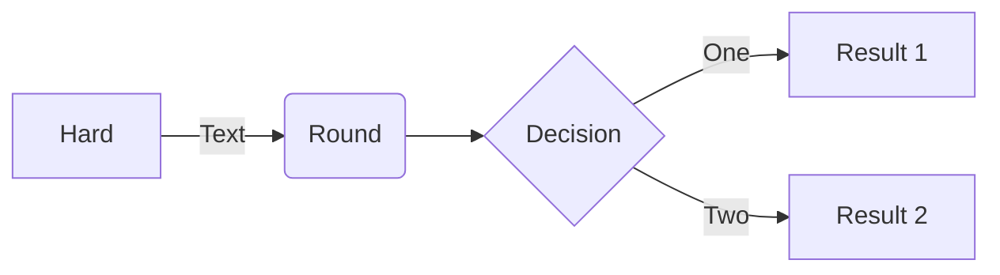
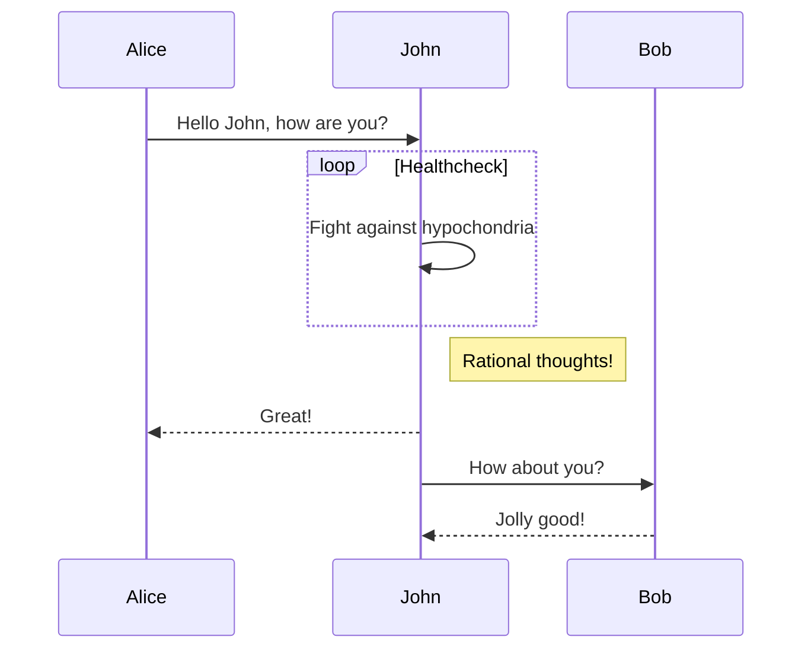

# heading1

## heading2

### heading3

#### heading4

something's working

**bold**

_italic_

- list item 1
- list item 2
- list item 3
- `code`

| Item         | Price     | # In stock |
|--------------|-----------|------------|
| Juicy Apples | 1.99      | *7*        |
| Bananas      | **1.89**  | 5234       |

C# code:
```csharp
var x = new int[] {};
```

Python code:
```python
def x():
  print "x"
```







Here's a simple footnote,[^1] and here's a longer one.[^bignote]

[^1]: This is the first footnote.

[^bignote]: Here's one with multiple paragraphs and code.

    Indent paragraphs to include them in the footnote.

    `{ my code }`

    Add as many paragraphs as you like.

- [x] Write the press release
- [ ] Update the website
- [ ] Contact the media

Gone camping! :tent: Be back soon.

~~Strikethrough~~

> This is a blockquote with two paragraphs. Lorem ipsum dolor sit amet,
> consectetuer adipiscing elit. Aliquam hendrerit mi posuere lectus.
> Vestibulum enim wisi, viverra nec, fringilla in, laoreet vitae, risus.
>
> > This is nested blockquote.
>
> Donec sit amet nisl. Aliquam semper ipsum sit amet velit. Suspendisse
> id sem consectetuer libero luctus adipiscing.

[title](https://www.example.com)

This is an H1
=============

This is an H2
-------------

---
